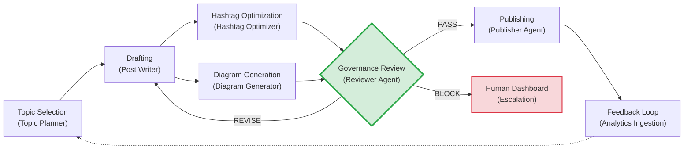

# Content Pipeline Workflow

## End-to-End Flow

```
Topic Selection → Drafting → Enhancement → Governance Review → Publishing → Feedback Loop
```

---

## Step 1: Topic Selection
- **Agent:** Topic Planner
- **Input:** `LinkedIn_Topics.xlsx`, `posted_topics.json`, `topic_embeddings/`
- **Process:**
  1. Load all candidate topics from the spreadsheet.
  2. Filter out topics published within the last 30 days (exact match + semantic similarity > 0.85).
  3. Rank remaining topics by `Priority` score and trending relevance.
  4. Select the top-ranked topic and generate a `TopicBrief` containing: angle, target audience, key talking points, and suggested post format (text-only, carousel, or diagram-post).
- **Output:** `TopicBrief` JSON → passed to Post Writer.

---

## Step 2: Drafting
- **Agent:** Post Writer
- **Input:** `TopicBrief` from Step 1
- **Process:**
  1. Receive the brief and generate a full LinkedIn post draft.
  2. Optimize for Hook Score (≥ 8/10) and Value Density per `gemini.md` scoring priorities.
  3. Structure the post with short paragraphs, whitespace, and a clear CTA.
- **Output:** `DraftPost` JSON → passed to Step 3 (parallel enhancement).

---

## Step 3: Enhancement (Parallel)
Two agents operate simultaneously on the `DraftPost`:

### 3a. Hashtag Optimization
- **Agent:** Hashtag Optimizer
- **Process:** Analyze post content, cross-reference trending tags, and append 3-5 optimized hashtags.
- **Output:** `HashtagSet` → merged into `DraftPost`.

### 3b. Diagram Generation
- **Agent:** Diagram Generator
- **Process:** Extract core technical concept from the post, generate a Mermaid.js diagram, render to `.png`.
- **Output:** `diagram.png` asset → attached to `DraftPost`.

---

## Step 4: Governance Review
- **Agent:** Reviewer (Compliance & Safety)
- **Input:** Enhanced `DraftPost` (with hashtags + diagram)
- **Process:**
  1. **Brand Compliance Check:** Does the tone match enterprise guidelines?
  2. **Factual Verification:** Are all claims substantiated or qualified?
  3. **Sensitive Data Scan:** Does the post contain proprietary, confidential, or personally identifiable information?
  4. **Deduplication Verification:** Final check that the topic hasn't been recently covered.
  5. **Legal Review:** Flag any content that could create regulatory or legal exposure.
- **Output:** `ReviewVerdict`
  - `PASS` → Proceed to Step 5.
  - `REVISE` → Return to Step 2 with specific feedback (max 3 loops).
  - `BLOCK` → Halt pipeline, notify human via dashboard.

> [!IMPORTANT]
> This step is the **Trust Boundary**. No content bypasses this gate. The Publisher agent cannot execute without a signed `PASS` token from the Reviewer.

---

## Step 5: Publishing
- **Agent:** Publisher
- **Input:** `PASS`-verified `DraftPost` + media assets
- **Process:**
  1. Format the post body for the LinkedIn V2 API.
  2. Upload any media assets (diagram images).
  3. Execute the `POST` call to `https://api.linkedin.com/v2/ugcPosts`.
  4. Capture the response (post URN, timestamp).
  5. Update `posted_topics.json` and write to `audit-log`.
- **Output:** Published post URL + `AuditLogEntry`.

---

## Step 6: Feedback Loop
- **Trigger:** 8-12 hours after publishing (during Analytics Ingestion window).
- **Process:**
  1. Pull engagement metrics (impressions, reactions, comments, shares) via LinkedIn API.
  2. Store metrics in the PostgreSQL `engagement_metrics` table.
  3. Update the `Engagement_Score` column in `LinkedIn_Topics.xlsx` for the published topic.
  4. Feed updated scores back to the Topic Planner to refine future topic selection.
- **Output:** Updated data sources for the next 24-hour cycle.

---

## Workflow Diagram


