# Multi-Agent Workflows

## 1. Primary Workflow (The Golden Path)
This is the standard, happy-path workflow for end-to-end content creation.

```mermaid
graph LR
    A[Scheduler Trigger] --> B[Topic Selection]
    B --> C[Vector Deduplication]
    C -- "Novel" --> D[Content Drafting]
    D --> E[Diagram Generation]
    E --> F[Compliance Review]
    F -- "Feedback Log" --> G[Feedback Capture]
    G --> H[Human Approval]
    H -- "APPROVED" --> I[LinkedIn API Publish]
    I --> J[Store & Analytics]
```

## 2. Retry Workflow (Revision Loop)
Triggered when the Review Agent detects a policy violation or quality miss.
- **Trigger**: Reviewer outputs `REVISE` verdict.
- **Action**: Return `DraftPost` + Reviewer Feedback to Content Generator.
- **Constraint**: Maximum 3 retries permitted.
- **Terminal State**: If `revisionCount > 3`, transition to Failure Workflow.

## 3. Approval Workflow (State Management)
Enforces Human-in-the-Loop validations before publishing.
1. System generates a finalized package (Text + Image).
2. State enters `REVIEW` via Reviewer Agent.
3. Upon Agent `PASS`, state enters `PENDING_HUMAN`.
4. Dashboard UI enables a single authorized user to click "APPROVED".
5. Publisher Agent consumes `APPROVED` state payload.

## 4. Failure Workflow (Fail-Safe Handling)
Triggered by extreme errors or Governance `BLOCK` actions.
- **Triggers**: Reviewer outputs `BLOCK`, API returns `500` multiple times, or max retries exceeded.
- **Action 1**: Log critical failure trace to `data/audit_log.json`.
- **Action 2**: Alter pipeline state to `FAILED`.
- **Action 3**: Send an alert to Human Orchestrator.
- **Action 4**: Safely terminate process (no dangling active loops).

## Local Sub-Workflows
For granular agent-specific logic, refer to the local workflow definitions:
- [Topic Planner Workflow](agents/topic-planner/workflows.md)
- [Content Generator Workflow](agents/content-generator/workflows.md)
- [Diagram Agent Workflow](agents/diagram-agent/workflows.md)
- [Reviewer Workflow](agents/reviewer/workflows.md)
- [Publisher Workflow](agents/publisher/workflows.md)
- [Scheduler Workflow](agents/scheduler/workflows.md)
- [Feedback Workflow](feedback/workflows.md)
- [Environment Workflow](environment/workflows.md)
- [Persistence Workflow](persistence/workflows.md)
